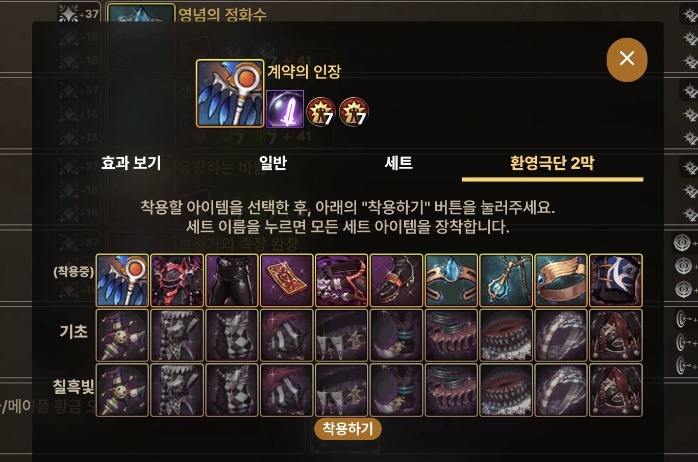
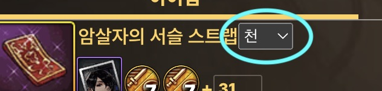
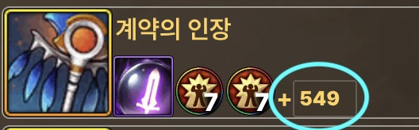
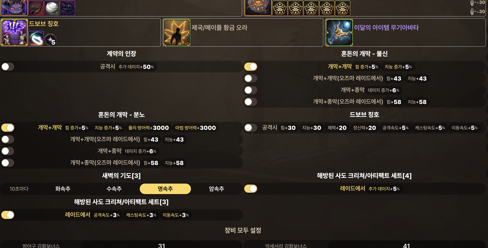
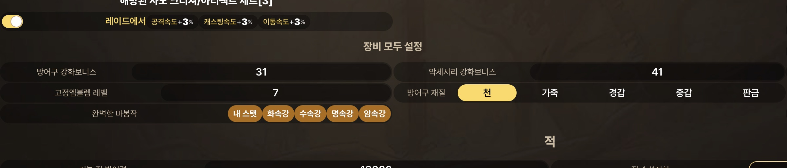
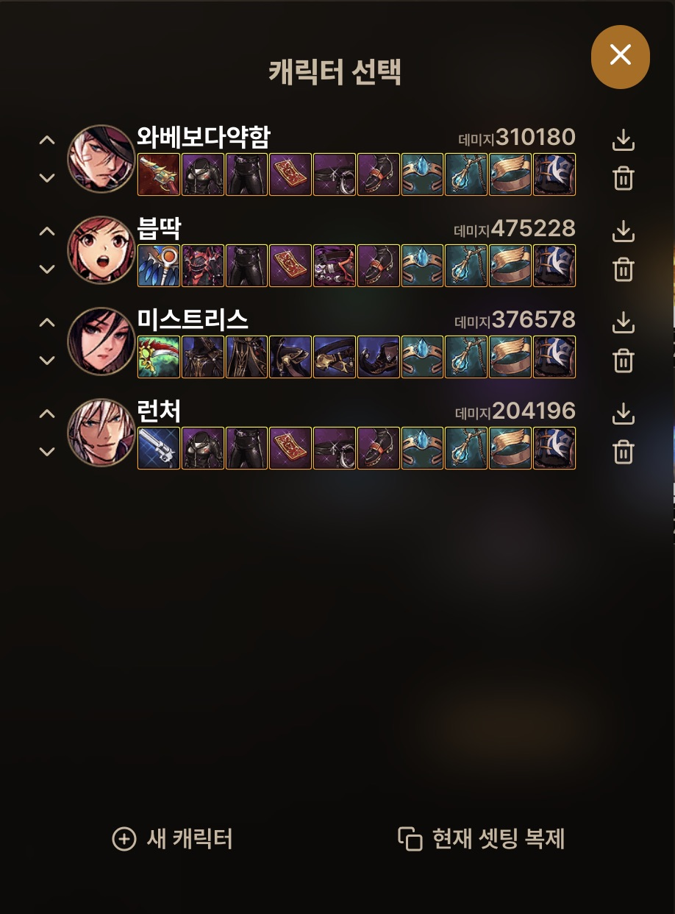
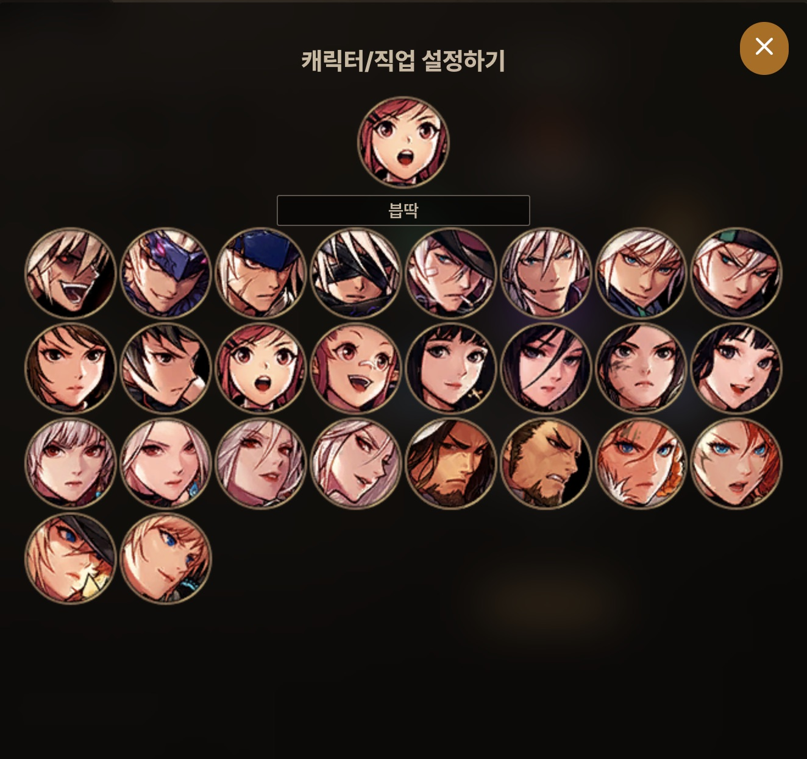
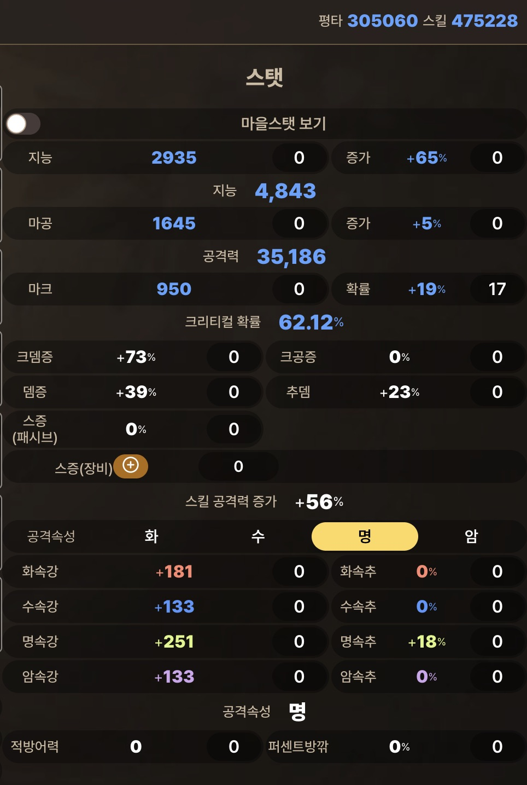

# 이게 뭐죠?

**던파모바일 스탯계산기!!!** 는 던파모바일의 아이템 세팅을 직접 입력해서 스탯과 데미지를 계산하는 웹 애플리케이션입니다.

> # 존나 중요함!!!
>
> - 이 앱은 여러분이 생각하는 미심쩍은 기능(인게임 핵, 매크로, 계정 데이터 추출 등)은 일절 **포함되어 있지 않습니다**.
> - 이 앱은 광고 등 **어떠한 수익도 창출하지 않습니다**. 서버에 접속 로그는 남을 수 있으나, 이외의 어떠한 개인정보도 수집하지 않습니다.
>

업데이트 내역은 [여기](CHANGELOG.md)를 참고하세요.

- [이게 뭐죠?](#이게-뭐죠)
- [사용 방법](#사용-방법)
  - [시작하기](#시작하기)
  - [아이템](#아이템)
    - [아이템 설정하기](#아이템-설정하기)
      - [환영극단 2막](#환영극단-2막)
    - [방어구재질 설정하기](#방어구재질-설정하기)
    - [강화 수치 설정하기](#강화-수치-설정하기)
    - [마법부여 설정하기](#마법부여-설정하기)
    - [엠블렘 설정하기](#엠블렘-설정하기)
    - [마법봉인 설정하기](#마법봉인-설정하기)
    - [조건부 효과](#조건부-효과)
    - [장비 모두 설정](#장비-모두-설정)
  - [기타 요소](#기타-요소)
  - [다캐릭터](#다캐릭터)
  - [스탯](#스탯)
    - [스탯 조정하기](#스탯-조정하기)
  - [스킬](#스킬)
    - [스킬 직접 입력하기](#스킬-직접-입력하기)
- [설치하기?](#설치하기)
- [문의](#문의)

# 사용 방법

## 시작하기

요즘 사용하는 브라우저(Chrome, Edge, Firefox, Safari 등)로 [https://dfm.nemi.ml/view](https://dfm.nemi.ml/view)에 접속합니다. PC, 모바일 모두 가능합니다.

## 아이템

### 아이템 설정하기

\[아이템] 탭에서 아이템 아이콘을 누르면, 적용할 아이템을 선택할 수 있습니다. (앞서 언급한대로 계정 데이터를 임의로 추출하는 기능은 없습니다. ㅈㅅ!)

\[아이템] 탭에서 적용 가능한 아이템은 다음과 같습니다.

- 무기
- 방어구(상의, 하의, 머리어깨, 벨트, 신발)
- 악세서리(팔찌, 목걸이, 반지)
- 보조장비
- 크리쳐, 아티팩트
- 봉인석, 정수
- 칭호
- 오라, 무기아바타

무기/방어구/악세서리/보조장비 선택 시, 아이템 선택 창의 \[세트] 탭에서 에픽 세트 아이템 또는 영할/영블/영악 세팅을 한번에 적용할 수 있습니다.

칭호, 오라, 무기아바타는 효과가 같은 것은 하나로 묶어놨습니다.

#### 환영극단 2막


무기/방어구/악세서리/보조장비 선택 시, 아이템 선택 창의 \[환영극단 2막] 탭에서 자신이 착용할 환영극단 2막 유니크 장비 부위를 선택할 수 있습니다.

- \[환영극단 2막] 탭에서는 장비를 누르면 장비가 즉시 적용되지 않고 임시로 저장되며, \[착용하기] 버튼을 눌러야 실제로 적용됩니다. \[착용하기] 버튼을 누르지 않고 선택 창을 닫으면 세팅이 적용되지 않습니다.
- 적용 예정인 장비들은 그 아이콘이 선명하게 표시됩니다.
- 왼쪽(PC) 또는 위(모바일)에 나타나는 세트 이름을 누르면 그 세트의 장비 10종이 모두 활성화됩니다. 이렇게 하고 나머지 2부위를 다른 것으로 선택하면 됩니다.

### 방어구재질 설정하기


PC에서는 \[아이템] 탭에서 방어구 이름 옆에 방어구재질 선택 메뉴가 나타납니다. 모바일에서는 \[강화] 탭에서 각 방어구 부위에 방어구재질 선택 메뉴가 나타납니다.

PC, 모바일 공통으로, 어떤 부위에 착용중인 방어구가 재질변경이 불가능한 경우(ex.환영극단 2막), 방어구재질 선택 메뉴가 나타나지 않습니다.


### 강화 수치 설정하기


PC(넓은 화면)에서는 \[아이템] 탭에서, 모바일(좁은 화면)에서는 \[강화] 탭에서, 장비의 각 부위에 나타난 노란색 숫자 값을 입력하여 강화 효과를 설정할 수 있습니다.

- **무기**: 물리/마법공격력 증가량
- **그 외**: 힘/지능 증가량

> 개발 초기에 **방어력** 보너스는 중요하지 않다 생각하여 **일단 제외**되었습니다. 여유가 된다면 추가예정!

### 마법부여 설정하기
PC에서는 \[아이템] 탭에서, 모바일에서는 \[강화] 탭에서, 장비의 각 부위에 나타난 카드 슬롯을 눌러 카드/보주를 선택할 수 있습니다.

"선택한 카드를 가능한 모든 부위에 바르기"를 켜면, 마법부여할 카드를 눌렀을 때 그 카드를 쓸 수 있는 모든 부위에 적용됩니다. 예를 들어, "타르타로스 카드"를 모든 부위에 바르기하면 팔찌, 목걸이, 반지의 마법부여가 모두 "타르타로스 카드"가 됩니다.

효과가 같은 여러 카드는 그 중 하나만 포함했습니다. (ex.지그하르트 / 달리아 스콧)

### 엠블렘 설정하기
PC에서는 \[아이템] 탭에서, 모바일에서는 \[강화] 탭에서 엠블렘을 설정할 수 있습니다.

- **무기, 보조장비, 칭호 이외의 부위의** 엠블렘을 누르면 해당 엠블렘의 레벨이 1 감소합니다. 엠블렘 레벨이 3일 때 누르면 엠블렘 레벨이 10으로 설정됩니다.
- **무기, 보조장비, 칭호** 엠블렘을 누르면 엠블렘 선택 창이 나타나며, 그곳에 엠블렘 레벨 입력필드와 해당 슬롯에 착용할 수 있는 모든 엠블렘이 나타납니다. **레벨을 먼저 입력한 후, 적용할 엠블렘 아이콘을 눌러야 합니다.** 엠블렘 레벨 입력 후 창을 닫아버리면 엠블렘 레벨 입력값이 적용되지 않습니다. 가능한 엠블렘 레벨은 3~10입니다.

### 마법봉인 설정하기
PC에서는 \[아이템] 탭에서, 모바일에서는 \[강화] 탭에서, 장비의 각 부위에 나타난 마법봉인 옵션 하나를 누르면 가능한 다음 마법봉인으로 바뀝니다.

적용되는 마법봉인은 다음과 같습니다.

- 데미지 증가
- 힘/지능
- 크리티컬
- 속성 강화
- 적중
- 공격속도


\<\< 이 아이콘은 "관심 없는 옵션"으로, 위의 어느 것에도 해당하지 않음을 나타냅니다.

> 모바일에서는 마법봉인 효과의 수치가 생략됩니다.

### 조건부 효과


"공격 시 xx% 확률로", "공격 시 xx초 동안", "던전 입장 시", "파티원 모두에게" 등 **마을에서 적용되지 않는 효과**는 \[아이템] 탭에서 아이템 선택 영역 아래에 나타납니다. 이 효과들을 눌러서 적용 여부를 ON/OFF할 수 있습니다. "(최대 x중첩)"이 붙은 효과는 중첩 횟수를 입력합니다.

대양 무기, "칠흑의 예언자" 세트, "새벽의 기도" 세트 등 여러 효과 중 하나만 적용되는 효과는 그 효과를 간단하게 나타낸 텍스트를 눌러서 적용할 수 있습니다.

> "공격 시 x% 추가 데미지"는 무조건 적용되는 효과로 분류됩니다.  
> 단, "공격 시 xx% 확률로 y% 추가 데미지"는 "확률"이 있으므로 조건부 효과로 분류됩니다.
>
> 간혹 ON/OFF 스위치가 나타나지 않는 조건부 효과가 있는데, 이들은 "던전 입장 시" 효과로 조건부 효과이면서 항상 적용됩니다 (아래의 [스탯](#스탯) 참고).

### 장비 모두 설정


PC에서는 \[아이템] 탭에서, 모바일에서는 \[강화] 탭에서, 각 장비 부위의 설정을 한번에 적용할 수 있습니다.

"방어구 강화보너스"는 방어구의 모든 힘/지능 강화보너스를 한번에 설정합니다. "악세서리 강화보너스"는 악세서리의 모든 힘/지능 강화보너스를 한번에 설정합니다.

"고정엠블렘 레벨"은 **무기, 보조장비, 칭호 이외의 모든 엠블렘**의 레벨을 한꺼번에 설정합니다.

"방어구 재질"은 모든 방어구 재질을 한꺼번에 설정할 수 있습니다.

## 기타 요소


이 탭에서는 캐릭터 레벨, 캐릭터 업적 레벨, 독립 공격력, 길드 버프, 마력결정, 의상 아바타의 레어리티를 설정할 수 있습니다.

> 마력 결정은 **모든 캐릭터에게 동일하게 적용됩니다.** (아래의 [다캐릭터](#다캐릭터) 참조)

## 다캐릭터


왼쪽 위의 캐릭터 초상화를 누르면 자신이 만든 캐릭터 목록이 나타납니다.

- 캐릭터 목록에는 각 캐릭터들의 직업, 이름, **계수 100%인 스킬의 평균 예상 데미지**, 10장비(무기, 방어구, 악세서리, 보조장비)가 간략하게 표시됩니다. 캐릭터를 누르면 그 캐릭터가 열립니다.
- 캐릭터는 다운로드받거나 삭제할 수 있습니다. 현재 열려있는 캐릭터는 삭제할 수 없습니다.
- \[새 캐릭터]를 누르면 캐릭터를 새로 만든 후 그 캐릭터가 열립니다.
- \[현재 셋팅 복제]를 누르면 지금 열려있는 캐릭터와 똑같은 캐릭터를 하나 더 만들고, 그 캐릭터가 열립니다.



왼쪽 위의 캐릭터 이름 바로 오른쪽에 있는 아이콘을 누르면 **현재 열려있는 캐릭터**의 이름, 직업을 설정할 수 있습니다.

## 스탯


PC에서는 화면 오른쪽에서, 모바일에서는 \[스탯 조정] 탭에서, 현재 세팅에서 각 스탯의 결괏값을 종합해서 볼 수 있습니다.

### 스탯 조정하기
이 값이 인게임에서 보이는 것과 다르다면, 각 스탯의 오른쪽에 나타난 입력 필드를 통해서 값을 직접 조정할 수 있습니다.

위의 \[마을스탯 보기]를 체크하면 **스탯 영역**에 한해서 [조건부 효과](#조건부-효과)가 모두 무효화됩니다. \[마을스탯 보기]는 오른쪽 위의 평균 데미지 및 스킬 데미지에는 영향을 주지 않습니다.

## 스킬
현재 세팅에서, 캐릭터의 현재 레벨에서 가능한 최대 레벨인 스킬의 예상 데미지를 볼 수 있습니다. 여기에 나타나는 스킬은 TP 및 "스킬 레벨 증가", "스킬 공격력 증가", "{특정 스킬} 공격력 증가 +x%" 효과가 모두 적용됩니다.


### 스킬 직접 입력하기
스킬은 [메인 개발자](https://github.com/nemi-dev)가 인게임에서 스킬 계수를 직접 입력하기 때문에, 그가 현재 던파모바일에서 키우고 있는 직업들의 스킬만 입력되어 있습니다.

\[스킬계수 직접 입력]에서는 사용자가 직접 스킬 계수를 입력할 수 있습니다. 이 영역의 데미지 표기값은 **"스킬 데미지 증가" 효과만 적용됩니다**.

> 인게임에서 나타난 스킬 계수는 TP 및 "스킬 레벨 증가", "{특정 스킬} 공격력 증가 +x%" 효과가 이미 모두 적용된 상태입니다. 이 계수를 보고 직접 입력하기만 하면 됩니다. 아쉽게도, 비교하려는 아이템을 갖고있지 않을 때는 스킬 계수를 따로 계산해야 합니다.
>
> tip> TP 및 모든 "{특정 스킬} 공격력 증가 +x%" 효과는 **모두 복리로 계산됩니다**.

# 설치하기?
데스크탑 앱으로 포팅([Electron](https://www.electronjs.org/) 등)할 계획이 있긴 합니다만, 아직까지는 개발 단계이기 때문에 오프라인에서 사용하려면 git을 이용해 이 리포지토리를 복제하는 방법밖에 없습니다(서버에 별도로 데이터를 저장하지 않으므로 이 방법이 가능은 하다는 것에 의의를 둡시다).

1. Node.js와 git을 설치합니다.
2. 이 리포지토리를 로컬에 복제하고, 패키지를 설치합니다.
   ````shell
   git clone https://github.com/nemi-dev/dfm-view.git
   cd dfm-view
   npm install
   ````
3. 프리뷰 서버를 실행합니다.
   ````shell
   npm run preview
   ````
4. 브라우저로 localhost:4173/view.html 에 접속합니다. 경우에 따라 "4173" 외에 다른 숫자를 입력해야 할 수 있습니다. 터미널 출력을 확인해주세요.

# 문의
기본적으로 [Issue](https://github.com/nemi-dev/dfm-view/issues)에서 버그/오류 제보를 받고 있습니다만, 이는 GitHub 계정이 필요하므로 타 사이트의 커뮤니티에서 남긴 댓글 제보도 확인하고 있습니다.

